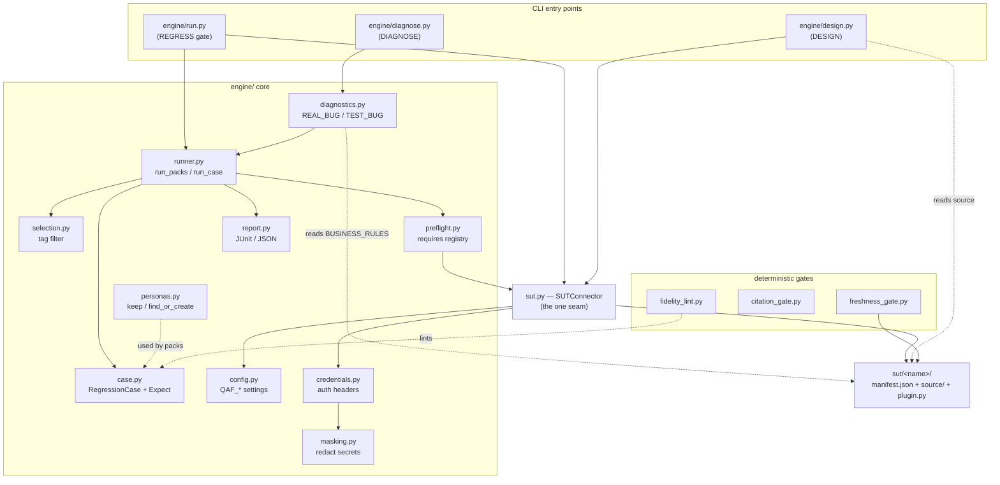
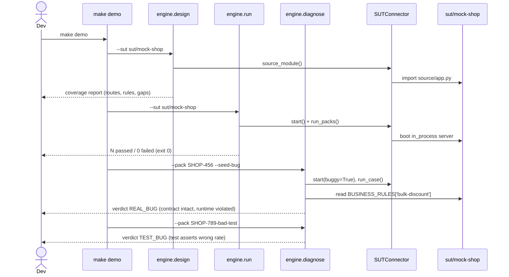

# Architecture

Qensei is a domain-agnostic QA framework: the product under test is a **plugin** under
`sut/<name>/`, so the same engine runs against a mock backend or a real one. It offers **three
capabilities over a single backend connection** (`engine/sut.py` `SUTConnector`):

| Capability | Module | What it does |
|-----------|--------|--------------|
| **DESIGN** | `engine/design.py` | reads the backend source (`ROUTES` + `BUSINESS_RULES`) and the packs' `covers`, reports coverage gaps |
| **REGRESS** | `engine/run.py` + `engine/runner.py` | runs the packs against the live backend — the merge gate |
| **DIAGNOSE** | `engine/diagnostics.py` + `engine/diagnose.py` | on a failure, classifies REAL_BUG vs TEST_BUG by reading the backend contract |

Design and diagnostics need the backend **source**; regression needs the backend **runtime**. Both
go through one `SUTConnector`, so adding a product means writing a plugin, not touching the core.

A SUT MAY also be **sourceless** (no `source` declared — a live runtime but no readable backend source):
then DESIGN reports only the packs' `covers` (no backend-surface gaps) and DIAGNOSE returns
`INDETERMINATE` — the contract of record is the ticket — while REGRESS still runs against the live
runtime. See [`sut/contract.md`](../sut/contract.md#sourceless-suts).

The framework is **driven by an AI coding assistant ([Claude Code](https://claude.com/claude-code))**:
the human-in-the-loop legs are Claude Code **slash commands** (`commands/`) and the advisory review panel
is a set of Claude Code **subagents** (`agents/`). The engine and gate below are plain Python and run
with no AI in the loop — the assistant works around the gate, never as it.

## Component map

## End-to-end: `make demo`

`make demo` exercises all three capabilities in sequence (design report → green gate → seeded
REAL_BUG → wrong-test TEST_BUG):

## Layers on disk

- **`engine/`** — the core (above). Pure stdlib, Python 3.14.
- **`policies/`** — product-neutral governance (spec phases, ownership, test philosophy, security,
  release-safety). See [quality-gates.md](quality-gates.md) for how the policies become forcing functions.
- **`sut/`** — the SITES under test, one self-contained plugin dir each. A site owns its backend
  access AND its tests: `source/`, `skills/`, `learnings/`, `packs/` (landed regressions —
  `case.py` + an index-card `README.md`), `specs/` + `plans/` (intent contracts + rationale),
  `tickets/`, `examples/`, `manifest.json` (+ optional `plugin.py`). `mock-shop/` and
  `restful-booker/` are the two full reference sites (`widget-api/` is a minimal **sourceless**
  fixture); see [the SUT contract](../sut/contract.md).
- **`commands/`** — the Claude Code slash commands the assistant runs: `/validate`, `/automate`,
  `/report-bug`.
- **`agents/` + `docs/multiagent/`** — the advisory review panel, run as Claude Code subagents (see
  [diagnostics-and-review-panel.md](diagnostics-and-review-panel.md)).

## Where to go next

- [The regression gate](regression-gate.md) — the REGRESS lifecycle end to end.
- [Targeting a real backend](remote-backend.md) — credentials, env selection, retry, masking.
- [Personas & data durability](personas-and-durability.md) — `new_user` vs `existing_data`.
- [Pre-flight & selection](preflight-and-selection.md) — requirements + tag lanes.
- [Deterministic quality gates](quality-gates.md) — the forcing functions.
- [Diagnostics & the review panel](diagnostics-and-review-panel.md) — REAL_BUG/TEST_BUG + the lenses.
