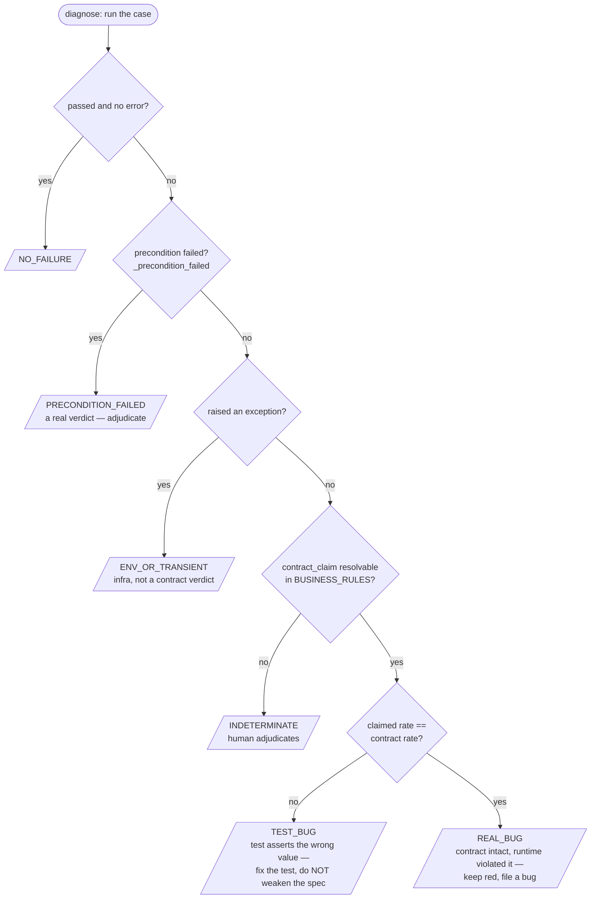
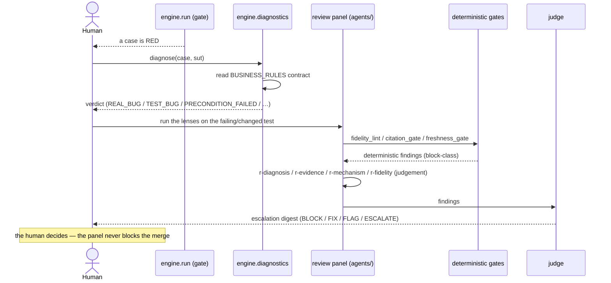

# Diagnostics & the review panel

When a case fails, the central question is: **TEST_BUG** (the test is wrong — fix it, never weaken the
spec) or **REAL_BUG** (the system regressed — keep the test red, file a bug)? Answering it requires
reading the backend **contract**, which is exactly why the framework has source access. Two layers
cooperate: a deterministic classifier (`engine/diagnostics.py`) and the advisory review panel
(`agents/`).

## The deterministic classifier (`engine/diagnostics.py`)

`diagnose(case_cls, sut)` runs the case, then walks a decision tree grounded in the backend's declared
`BUSINESS_RULES`:



The key distinctions:

- **PRECONDITION_FAILED vs ENV_OR_TRANSIENT** — a case that calls `expect.precondition(...)` raises
  `PreconditionError`, which the runner tags (`_precondition_failed`). Diagnostics treats that as a
  **real** verdict (the setup the contract depends on is absent), *not* a flake — so a genuine
  precondition failure is never dismissed as transient infra.
- **TEST_BUG vs REAL_BUG** — both require the case's `contract_claim` to resolve against a backend
  rule. If the claimed value disagrees with the source contract, the test is wrong (TEST_BUG); if it
  agrees but the running system violated it, the platform regressed (REAL_BUG). The spec intent is
  never weakened either way.

```bash
python3 -m engine.diagnose --sut sut/mock-shop --pack packs/SHOP-456-discount --seed-bug   # REAL_BUG
python3 -m engine.diagnose --sut sut/mock-shop --pack examples/diagnostics/SHOP-789-bad-test  # TEST_BUG
```

## The advisory review panel (`agents/`)

The classifier answers the mechanical question. The **review panel** adds judgement for the calls a
mechanism cannot make. It is advisory by construction: every lens carries `gate: false` and **none can
block a merge** — the human owns convergence; the panel *raises the floor*.

| Lens | Role | Deterministic counterpart it complements |
|------|------|------------------------------------------|
| **r-diagnosis** | classify TEST_BUG / REAL_BUG / TRANSIENT / escalate, before any fix | `engine/diagnostics.py` |
| **r-evidence** | anti-fabrication; verify each claim against raw source; the green dot is not evidence | `engine/citation_gate.py` |
| **r-mechanism** | force timing/scheduling/state reasoning into the open with `source:line` citations | `engine/freshness_gate.py` |
| **r-fidelity** | catch an edit that weakens an acceptance criterion to go green | `engine/fidelity_lint.py` |
| **r-uplift** | (migration only) verify a ported legacy test adopted framework patterns | — |
| **judge** | adjudicate the lenses' findings; write the escalation digest | — |

Each advisory lens has a **deterministic companion** that *can* gate (right column). The lens supplies
judgement (e.g. *is this restructured assertion a disguised weakening or a legitimate reshape?*); the
companion supplies the non-negotiable, identical-input-identical-verdict check. See
[quality-gates.md](quality-gates.md) for the companions and `agents/README.md` for the full registry.

## How they fit together on a failure



The discipline that binds both layers: **the validation objective stated in the spec is never weakened
to make a test pass.** If the backend legitimately cannot satisfy an acceptance criterion, the test is
correctly red and the bug is real.

See also: [the regression gate](regression-gate.md), [deterministic quality gates](quality-gates.md).
