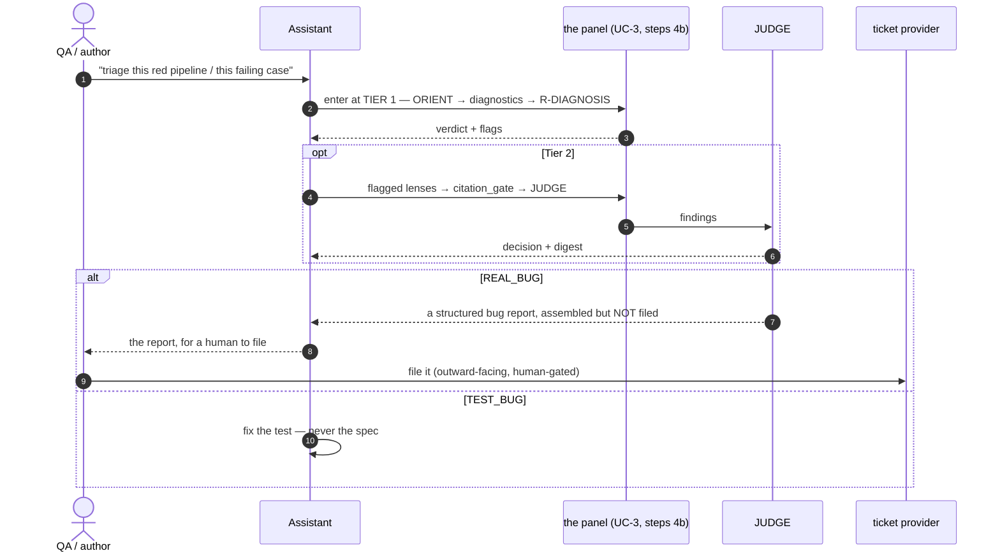

# End-to-end workflow — use cases and sequence diagrams

How a piece of work actually moves through Qensei: who acts, in what order, where a human decides, and
where the loop closes. [walkthrough.md](walkthrough.md) narrates the same journey as a story on one
example; this page is the **actor-and-action** view, for when you need to know *who does what when*.

Four use cases, from the common one to the exceptions:

| # | Use case | When |
|---|---|---|
| [UC-1](#uc-1--the-normal-path-functional-test--merged-regression) | functional test → merged regression | the everyday path |
| [UC-2](#uc-2--the-design-panel-phase-2b) | the design panel, before code exists | every new pack |
| [UC-3](#uc-3--validate-and-iterate-phase-4-the-red-ci-loop) | validate-and-iterate: the red-CI loop | whenever the gate goes red |
| [UC-4](#uc-4--on-demand-triage-of-a-failed-run) | on-demand triage of a failed run | a human points at a red pipeline |

## The cast

| Actor | What it is | Authority |
|---|---|---|
| **QA / author** | the human | owns intent, scope, approvals, and the merge |
| **Assistant** | Claude Code running `/validate`, `/automate`, `/report-bug` | writes the spec, the plan and the pack; never merges |
| **Panel** | the `agents/` lenses, dispatched as read-only subagents | advisory — raises the floor, **never gates a merge** |
| **Gate** | `engine/` — plain Python, **no AI in the loop** | the single source of truth for "green" |
| **CI** | the workflow fanning the gate over every SUT | runs the gate where the human can see it |
| **SUT** | the product under test, reached only through its plugin's `SUTConnector` | — |

Two rules explain most of the shape below. **Deterministic-first**: never LLM what a rule can decide, so
a lint runs before a lens every time. **Advisory with a record**: the panel cannot block, but *whether it
ran* is linted, because a policy without a gate is not followed. Both are stated in full in
[execution-architecture.md](multiagent/execution-architecture.md).

## UC-1 — the normal path: functional test → merged regression

The everyday journey. A manually-validated ticket becomes permanent coverage: intent is approved by a
human, the design is reviewed before code exists, the implementation is iterated against the real gate,
and the merge is a human decision.

```mermaid
sequenceDiagram
  autonumber
  actor QA as QA / author
  participant A as Assistant (Claude Code)
  participant P as Panel (read-only lenses)
  participant G as Gate (engine/ — no AI)
  participant CI as CI
  participant S as SUT (via SUTConnector)

  Note over QA,S: PHASE 0-1 · orient and gather
  QA->>A: /validate TICKET --sut sut/&lt;name&gt;
  A->>G: freshness check on the SUT source
  G-->>A: FRESH (no-op for an in-process or sourceless SUT)
  A->>S: exercise each acceptance criterion (REST, or a real browser for UI)
  A-->>QA: run report — PASS / FAIL / SKIPPED per criterion
  A->>QA: ASK — persona coverage: new_user, existing_data, or both?
  QA-->>A: the answer (a human decision, not inferred)

  Note over QA,S: PHASE 2 · the spec is intent, and it is approved
  A->>A: write sut/&lt;name&gt;/specs/&lt;id&gt;.md — context, AC, persona, risks
  A-->>QA: surface the spec for review
  QA-->>A: HUMAN GATE — approve, amend, or reject

  Note over QA,S: PHASE 2b · the plan, reviewed BEFORE any code
  A->>A: write sut/&lt;name&gt;/plans/&lt;date&gt;-&lt;slug&gt;.md — REST mapping, case shape
  A->>P: R-DESIGN (Tier 1, always) over the (spec, plan) pair
  P-->>A: at most 6 ranked findings F1..Fn + needs_mechanism / needs_evidence
  opt a flag is set
    A->>P: R-MECHANISM / R-EVIDENCE (Tier 2)
    P-->>A: CITED / UNCITED / MISREAD, verified against the SUT source
  end
  A->>A: record a PROPOSED disposition per finding in the plan
  G-->>A: design_panel_lint — the record is present and reconciles
  A-->>QA: findings + proposed dispositions
  QA-->>A: HUMAN GATE — ratify or override (there is no judge at 2b)

  Note over QA,S: PHASE 3 · implement
  A->>A: make new-pack / new-ui-pack, then fill the skeleton in
  G-->>A: fidelity_lint + coverage_lint on every edit

  Note over QA,S: PHASE 4 · validate-and-iterate — see UC-3
  A->>G: make test across every configured env
  G->>S: run every pack from a clean state
  G-->>A: PASS / FAIL / SKIP + exit code
  A->>CI: push the branch, open the PR
  CI->>G: the gate, fanned over every SUT
  CI-->>A: red or green
  loop while red — cap 3 cycles per ROOT CAUSE
    A->>P: triage BEFORE any fix (UC-3)
    P-->>A: verdict + adjudicated findings
    A->>A: fix WITH context — never weakening a criterion
    A->>CI: push again
    CI-->>A: re-run result
  end

  Note over QA,S: PHASE 5 · record, then the human merges
  A->>A: validation report (incl. the Panel record) + spec reconciliation + index card
  G-->>A: panel_section_lint — the report says whether the panel ran
  A-->>QA: PR ready, gate green, every AC checked
  QA->>QA: HUMAN GATE — review and merge
```

**What to notice.** Three human gates, not one: persona coverage, spec approval, and the merge — plus the
2b ratification. The panel appears twice and blocks neither time. And the only actor that decides "green"
is the gate, which has no model in it.

## UC-2 — the design panel (Phase 2b)

The zoom on the step that is easy to skip. It exists because every other lens fires in Phase 4 — *after* a
design defect has been implemented and has already cost gate cycles. Here the defect is still a review
comment.

```mermaid
sequenceDiagram
  autonumber
  actor QA as QA / author
  participant A as Assistant (GENERATOR)
  participant L as coverage_lint
  participant RD as R-DESIGN
  participant RM as R-MECHANISM / R-EVIDENCE
  participant DL as design_panel_lint

  A->>L: the deterministic answer first — does the metadata RESOLVE?
  L-->>A: consistent / BLOCK  (a lens is never spent on what a rule can decide)
  A->>RD: review the (spec, plan) pair — Tier 1, ALWAYS, as a subagent
  Note right of RD: self-gates SUT-source freshness;<br/>10 checklist items: ticket scope → AC,<br/>persona, REST-first, false-SKIP,<br/>shared durables, write-then-read,<br/>covers vs what the plan exercises
  RD-->>A: F1..Fn — item, severity, a file:line or an explicit hypothesis, one alternative
  RD-->>A: needs_mechanism / needs_evidence
  opt needs_mechanism
    A->>RM: verify the mechanism claim against the SUT source
    RM-->>A: CITED / UNCITED / MISREAD + every mechanism call surfaced
  end
  A->>A: write one "F&lt;n&gt; APPLIED / REJECTED / FLAGGED / DEFERRED + reason" line per finding
  A->>DL: commit the plan
  DL-->>A: the record is present and the count reconciles, or the commit fails
  A-->>QA: the findings and the PROPOSED dispositions
  QA-->>A: ratify or override — at the spec-approval gate that already exists
```

**No judge here, deliberately.** Phase 2b already stops at a human one step later and fields one or two
lenses with at most six findings — there is nothing to dedup and no rebuttal protocol to run. Adding an
adjudicator in front of the approval gate would make an advisory lens the de-facto design gate. R-DESIGN
never writes a disposition; the assistant proposes and the human decides.

## UC-3 — validate-and-iterate (Phase 4): the red-CI loop

**This is the phase people mean by "the review phase":** the loop where you code, run, push, read the CI
failure, triage it, fix, and run again. Its name in this framework is **Phase 4 — Validate (iterative)**,
the *validate-and-iterate loop*, and its defining property is that **triage happens before any fix**.

```mermaid
sequenceDiagram
  autonumber
  participant A as Assistant
  participant CI as CI
  participant G as Gate (engine/)
  participant O as ORIENT (record, not a lens)
  participant D as engine/diagnostics.py
  participant RD as R-DIAGNOSIS
  participant T as R-EVIDENCE / R-MECHANISM
  participant CG as citation_gate
  participant J as JUDGE

  A->>CI: 4a — push; CI runs the gate over every configured env
  CI->>G: make test
  G-->>CI: exit 0 green · exit 1 a real failure · exit 2 false-green guard
  CI-->>A: NON-GREEN

  rect rgb(245,245,245)
    Note over A,J: 4b — TIER 1, always, before ANY code change
    A->>O: read the record for this pack
    O-->>A: rejected_fixes · contradicts_subject · prior_attempts · the ACs
    A->>D: the mechanical verdict (when the case carries a resolvable contract_claim)
    D-->>A: REAL_BUG / TEST_BUG / ENV_OR_TRANSIENT / INDETERMINATE
    A->>RD: R-DIAGNOSIS as a SUBAGENT — inline self-triage is not a substitute
    RD-->>A: verdict + needs_evidence / needs_mechanism
  end

  alt any Tier-2 trigger fires
    Note over A,J: flags · REAL_BUG / escalate · 2nd cycle on the SAME root cause ·<br/>a fidelity reshape ack · a pack's FIRST landing
    A->>T: verify the claims and the mechanism — flag-gated, the two run in parallel
    T-->>A: findings, each carrying a citation
    A->>CG: resolve every file:line the lenses emitted
    CG-->>A: exit 0 resolves · 1 FABRICATED · 3 unverifiable
    A->>J: adjudicate
    J-->>A: BLOCK / FIX / FLAG / ESCALATE + a decision-grade digest
  else no trigger
    Note over A: Tier 1 was enough — fix directly
  end

  A->>A: 4c — fix WITH context; capture a learning; NEVER weaken a criterion
  G-->>A: fidelity_lint blocks a weakened AC; R-COVERAGE flags an unexercised one
  A->>CI: re-run

  Note over A,J: 4d — 3 cycles on the SAME root cause → STOP and escalate.<br/>4e — exit when green everywhere AND every coverage GAP is resolved or accepted.
```

**Why triage precedes the fix.** A red case has two opposite causes — the test is wrong (fix the test) or
the system regressed (keep it red and file a bug) — and guessing wrong is expensive in both directions.
A verdict of `REAL_BUG` means the loop **stops**: the correct outcome is a red test and a structured,
human-filed defect, not a green one.

**Why "the failure looks simple" is not a reason to skip Tier 1.** The value is independent depth per
lens, not the triage label. Measured in the framework this panel came from: an inline triage that
classified 3/3 failures *correctly* still missed five pre-merge findings the retroactive panel surfaced.

## UC-4 — on-demand triage of a failed run

The same protocol, entered from the other side: a human hands the assistant a red pipeline instead of the
loop reaching it. Nothing about the sequence changes — which is the point of the freshness and citation
gates self-gating **at the point of consumption** rather than inside `/automate`.



A **deterministic alternative** exists for this entry point: `workflows/review-panel.js` runs the same
sequence as a script (subject gate → ORIENT → `engine.diagnostics` → R-DIAGNOSIS → flagged lenses →
`engine.citation_gate` → JUDGE), for live observability and schema-validated findings. It is
human-triggered because it spawns several agents; the model-driven path above stays the default. See
[`workflows/README.md`](../workflows/README.md).

## Where each step is specified

| Step | Source of truth |
|---|---|
| The phases and their gates | [`commands/automate.md`](../commands/automate.md) |
| Who is dispatched, when, and who decides | [execution-architecture.md](multiagent/execution-architecture.md) |
| How the lenses run together on one failure | [review-panel.md](multiagent/review-panel.md) |
| What R-DESIGN checks at 2b | [r-design.md](multiagent/r-design.md) |
| The deterministic gates and their exit codes | [quality-gates.md](quality-gates.md) |
| REAL_BUG vs TEST_BUG | [diagnostics-and-review-panel.md](diagnostics-and-review-panel.md) |
| The same journey as a narrated story | [walkthrough.md](walkthrough.md) |
