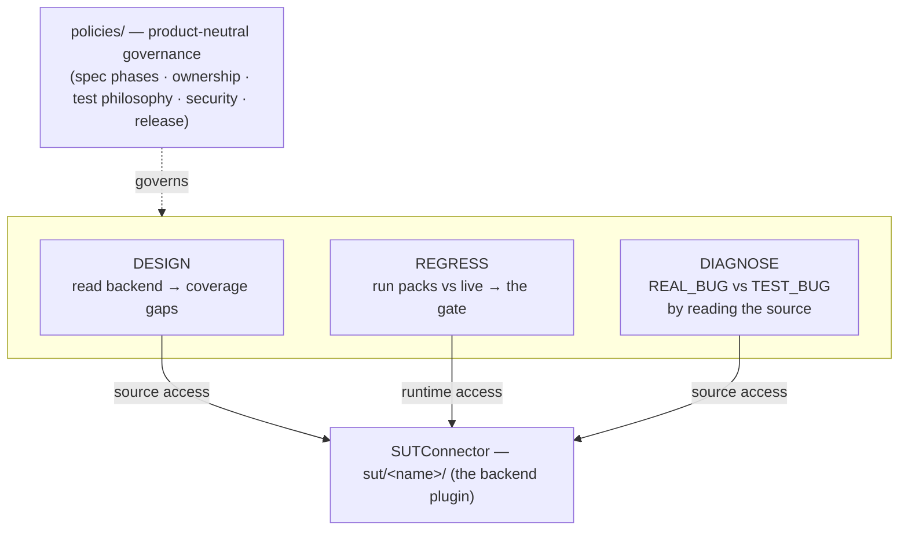
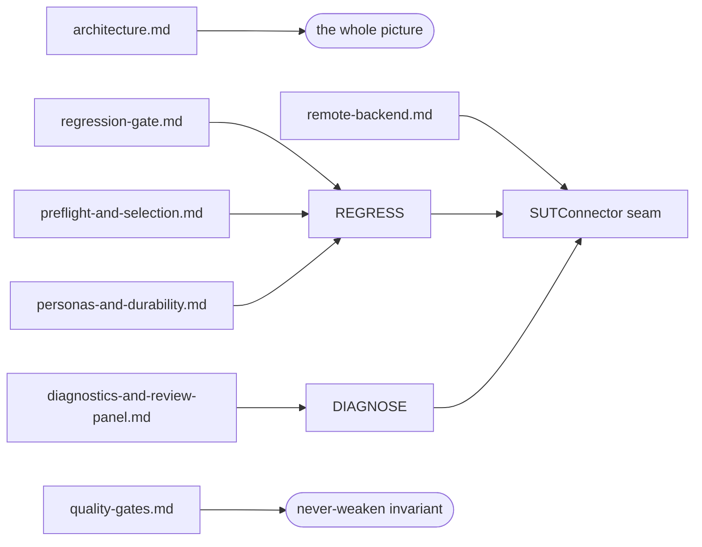

# Qensei — documentation map

A map-level reference and the entry point to the docs. Living document: update it when a capability,
policy, or layer changes.

## Thesis

One backend-aware QA framework with **three capabilities over a single backend connection**. The
product under test is a plugin (`sut/<name>/`), so adding a product means writing a plugin, not
touching the core.

Design and diagnostics need the backend **source**; regression needs the backend **runtime**. Both go
through one `SUTConnector`.

## Execution model — an AI coding assistant (Claude Code)

The framework was **built for, and runs inside, an AI coding assistant — [Claude Code](https://claude.com/claude-code)**.
The assistant drives the human-in-the-loop legs through **slash commands** (`commands/` —
`/validate`, `/automate`, `/report-bug`) and spawns the advisory **review panel** as **subagents**
(`agents/`), following the `policies/` as governance. The deterministic engine and regression gate
(`engine/`) are plain Python and run with **no AI in the loop** — the assistant works *around* the gate,
never *as* it, and the human owns convergence. See the [review-panel protocol](multiagent/review-panel.md).

## The documentation set

| Page | Covers |
|------|--------|
| [architecture.md](architecture.md) | the component map, the three capabilities, the plugin model, an end-to-end `make demo` |
| [regression-gate.md](regression-gate.md) | the gate lifecycle, exit codes, the false-green guard, the report artifact |
| [personas-and-durability.md](personas-and-durability.md) | `new_user` vs `existing_data`, find-or-create, keep/ephemeral naming, the no-delete guard, teardown |
| [remote-backend.md](remote-backend.md) | credentials + auth injection, env selection, the uncommitted config channel, TLS, retry, masking, pagination, plugin hooks |
| [preflight-and-selection.md](preflight-and-selection.md) | `requires` + the requirement registry (skip/block), tag selection + lanes, the CI matrix |
| [quality-gates.md](quality-gates.md) | the deterministic forcing functions: fidelity lint, citation gate, freshness gate, pre-commit + CI |
| [diagnostics-and-review-panel.md](diagnostics-and-review-panel.md) | the REAL_BUG/TEST_BUG classifier and the advisory review lenses it pairs with |
| [delivered-regressions.md](delivered-regressions.md) | the generated index of landed packs (`make regen-index`) |
| [the SUT contract](../sut/contract.md) | how to write a plugin: manifest keys + the optional `plugin.py` hooks |

Each page links a capability to the code that implements it:

## Layers on disk

- **`engine/`** — the core: `sut.py` (backend access), `case.py` (the soft-assert regression unit +
  matchers + personas hooks), `runner.py` (the gate), `run.py` (CLI + false-green guard),
  `design.py`, `diagnostics.py`, plus `config.py` / `credentials.py` / `masking.py` / `preflight.py` /
  `selection.py` / `personas.py` / `report.py` and the deterministic gates `fidelity_lint.py` /
  `citation_gate.py` / `freshness_gate.py`.
- **`policies/`** — product-neutral governance (spec phases, ownership, test philosophy, security,
  release-safety). [quality-gates.md](quality-gates.md) shows how the policies become forcing functions.
- **`sut/`** — the SITES under test, one **self-contained** plugin dir each. A site owns its backend
  access AND its tests: `source/` (backend), `skills/` + `learnings/` (manual-QA context), `packs/`
  (landed regressions: `case.py` + index-card `README.md`), `specs/` + `plans/` (intent contracts +
  implementation rationale), `tickets/`, `examples/`, and `manifest.json` (+ optional `plugin.py`).
  `mock-shop/` and `restful-booker/` are the two reference sites; a real product is the same shape.
  `make new-pack SUT=sut/<name>` scaffolds a pack into a site; `make regen-index` aggregates every
  site's cards into [delivered-regressions.md](delivered-regressions.md).
- **`commands/`** — the **Claude Code slash commands** the assistant runs: `/validate` (verify a
  ticket vs the SUT), `/automate` (a validated result → an automated REST/UI pack), `/report-bug`.
- **`agents/` + `docs/multiagent/`** — the advisory review panel, run as **Claude Code subagents**.
- **`tools/tests/`** — engine + gate unit tests (`make test-engine`).

## Why packs (one directory per case)

A **pack** is a self-contained unit — `case.py` (the test) plus an index-card `README.md`, next to
its `spec` — living in its own `packs/<id>/` (or `ui-packs/<id>/`) directory. Three reasons this
shape is deliberate:

- **Localized blast radius under AI-assisted, multi-agent editing.** The framework is built to run
  inside an AI coding assistant (see [Execution model](#execution-model--an-ai-coding-assistant-claude-code)),
  frequently with several agents — or humans refactoring AI-generated code — editing in parallel.
  One case per directory keeps each change confined to its own folder, so concurrent edits and
  refactors seldom touch the same file. A conflict stays contained to a single case instead of
  rippling through one shared, monolithic test module.
- **Per-site isolation.** Packs live under `sut/<name>/packs/`, which is what makes a site
  self-contained: the gate for one site never discovers another's cases (see the
  [SUT contract](../sut/contract.md)).
- **Self-documenting and aggregatable.** Each pack carries its index-card `README.md` beside the
  `case.py`; `make regen-index` rolls every card up into
  [delivered-regressions.md](delivered-regressions.md) — a catalog of landed regressions with no
  hand-maintained list.

## How the pieces compose

| Concern | What provides it |
|---------|------------------|
| Manual-QA design (domain skills, learnings, test-case design) | the **DESIGN** capability + each site's `sut/<name>/skills` + `learnings` |
| Automated regression + failure triage (specs, packs, personas, the merge gate, the diagnostic lenses) | the **REGRESS** + **DIAGNOSE** capabilities + each site's `sut/<name>/specs` + `packs` |
| Development governance (spec-driven workflow, ownership, test philosophy) | the **`policies/`** |

The idea binding them is that **one backend connection serves both test design and diagnostics** —
which is why "backend access" is the framework's central abstraction.

## Status & next

v0 runs the three capabilities end-to-end against **two** sites — `mock-shop` and `restful-booker` —
with the full gate machinery (auth/env seams, pre-flight, personas/durability, selection lanes, the
deterministic gates, CI fanned over both sites). The second site validated that the SUT seam is really
generic: it dropped in with no change to `engine/` or `policies/`. Open next steps: the manual-validation
leg, the ticket→spec handoff, and a real authenticated backend behind the booker's `live`-env path.
