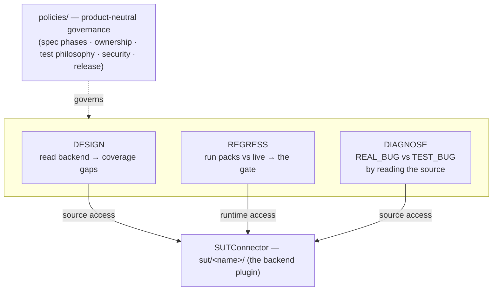

# qa-framework — documentation map

A map-level reference and the entry point to the docs. Living document: update it when a capability,
policy, or layer changes.

## Thesis

One backend-aware QA framework with **three capabilities over a single backend connection**. The
product under test is a plugin (`sut/<name>/`), so adding a product means writing a plugin, not
touching the core.

Design and diagnostics need the backend **source**; regression needs the backend **runtime**. Both go
through one `SUTConnector`.

## The documentation set

| Page | Covers |
|------|--------|
| [architecture.md](architecture.md) | the component map, the three capabilities, the plugin model, an end-to-end `make demo` |
| [regression-gate.md](regression-gate.md) | the gate lifecycle, exit codes, the false-green guard, the report artifact |
| [personas-and-durability.md](personas-and-durability.md) | `new_user` vs `existing_data`, find-or-create, keep/ephemeral naming, the no-delete guard, teardown |
| [remote-backend.md](remote-backend.md) | credentials + auth injection, env selection, the uncommitted config channel, TLS, retry, masking, pagination, plugin hooks |
| [preflight-and-selection.md](preflight-and-selection.md) | `requires` + the requirement registry (skip/block), tag selection + lanes, the CI matrix |
| [quality-gates.md](quality-gates.md) | the deterministic forcing functions: fidelity lint, citation gate, freshness gate, pre-commit + CI |
| [diagnostics-and-review-panel.md](diagnostics-and-review-panel.md) | the REAL_BUG/TEST_BUG classifier and the advisory review lenses it pairs with |
| [delivered-regressions.md](delivered-regressions.md) | the generated index of landed packs (`make regen-index`) |
| [the SUT contract](../sut/contract.md) | how to write a plugin: manifest keys + the optional `plugin.py` hooks |

Each page links a capability to the code that implements it:

## Layers on disk

- **`engine/`** — the core: `sut.py` (backend access), `case.py` (the soft-assert regression unit +
  matchers + personas hooks), `runner.py` (the gate), `run.py` (CLI + false-green guard),
  `design.py`, `diagnostics.py`, plus `config.py` / `credentials.py` / `masking.py` / `preflight.py` /
  `selection.py` / `personas.py` / `report.py` and the deterministic gates `fidelity_lint.py` /
  `citation_gate.py` / `freshness_gate.py`.
- **`policies/`** — product-neutral governance (spec phases, ownership, test philosophy, security,
  release-safety). [quality-gates.md](quality-gates.md) shows how the policies become forcing functions.
- **`core/specs` + `core/plans`** — intent contracts (human-approved) and implementation rationale.
- **`packs/`** — landed regressions, one dir each (`case.py` + index-card `README.md`); `make new-pack`
  scaffolds one, `make regen-index` aggregates the cards.
- **`sut/`** — the plugins. `mock-shop/` is the reference; a real product is the same shape.
- **`agents/` + `docs/multiagent/`** — the advisory review panel.
- **`tools/tests/`** — engine + gate unit tests (`make test-engine`).

## Lineage (what it generalises)

| Source of the pattern | What it contributes here |
|----------------------|--------------------------|
| A manual-QA context agent (domain skills, learnings, test-case design) | the **DESIGN** capability + `sut/<name>/skills` + `learnings` |
| A REST regression framework (specs, packs, personas, the merge gate, the diagnostic lenses) | the **REGRESS** + **DIAGNOSE** capabilities + `core/` + `packs/` |
| A spec-driven methodology | the **`policies/`** governance |

The single new idea binding them is that **one backend connection serves both test design and
diagnostics** — which is why "backend access" is the framework's central abstraction.

## Status & next

v0 runs the three capabilities end-to-end against `mock-shop`, with the full gate machinery (auth/env
seams, pre-flight, personas/durability, selection lanes, the deterministic gates, CI). Open next steps:
a second SUT plugin (validates the seam is really generic), the manual-validation leg, and the
ticket→spec handoff.
