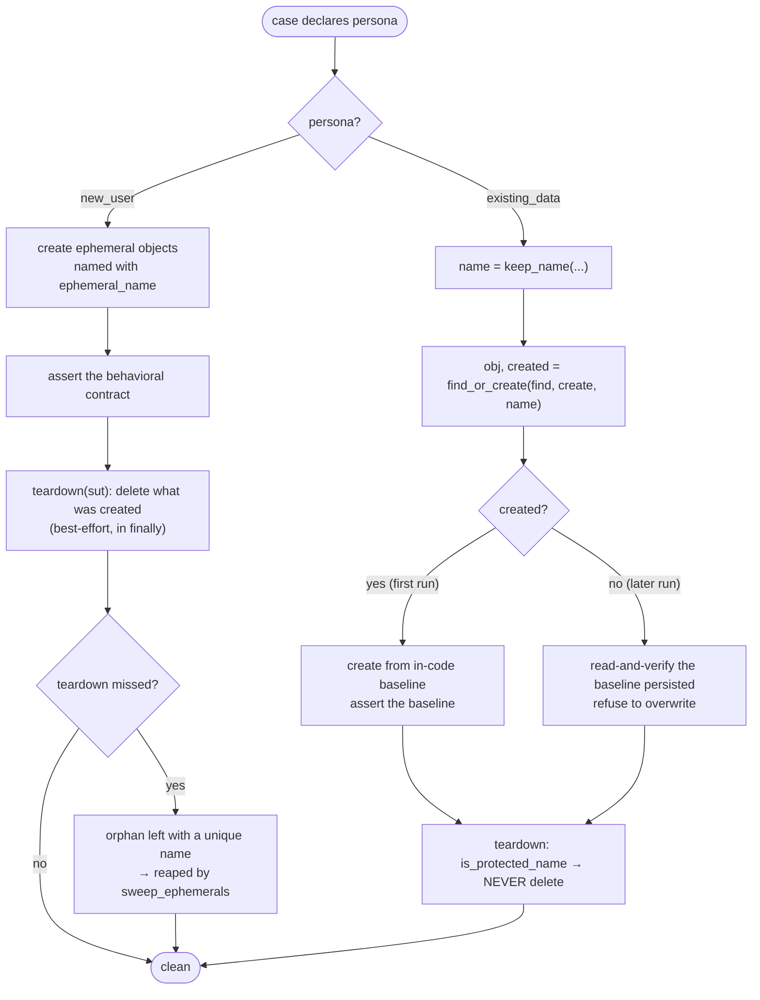
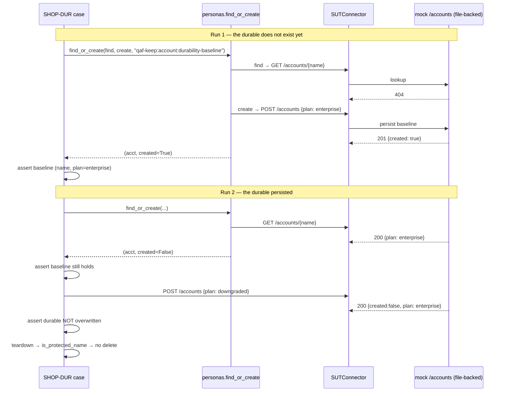

# Personas & data durability

Every case declares a **persona** (`engine/case.py`); it determines how the case treats the data it
touches on a shared backend.

| Persona | Meaning | Data lifecycle |
|---------|---------|----------------|
| `new_user` | fresh-instance creation | creates ephemeral objects, **self-cleans** (`teardown`) |
| `existing_data` | durability / migration regression | operates on long-lived objects via **find-or-create**; **never deletes** them |

The `new_user` persona proves a feature works from scratch. The `existing_data` persona is the one
that catches **data loss on migration**: a durable object that silently fails to persist (or loses a
field) across a deploy. A suite that only ever creates throwaway objects cannot catch that.

## The naming + guard primitives (`engine/personas.py`)

```python
keep_name("account", "baseline")      # -> "qaf-keep:account:durability-baseline"   (durable, stable id)
ephemeral_name("conn")                # -> "qaf-ephemeral:conn:9f3a1c0b"             (unique, sweepable)
is_protected_name("qaf-keep:...")     # -> True  (the no-delete guard cleanup MUST honour)
find_or_create(find, create, name)    # -> (obj, created)  created=True only on the first run
```

- `keep_name` builds a **stable, prefixed** id so a durable object is found the same way on every run
  (idempotency) and is recognisably protected.
- `ephemeral_name` adds a uuid so a **missed** teardown leaves a harmless, uniquely-named, *sweepable*
  leftover (reaped out-of-band via the plugin's `sweep` hook).
- `is_protected_name` is the guard any cleanup/teardown/sweep path must consult — a `qaf-keep:` object
  is never deleted.
- The prefixes are plugin-configurable; the helpers are generic framework logic.

## Choosing the path



## Find-or-create across runs (the durability contract)

The worked example is `sut/mock-shop/packs/SHOP-DUR-account-durability/`, run against the mock's
**file-backed** account store (`sut/mock-shop/source/app.py`: `POST /accounts` is idempotent —
`201 created:true` the first time, `200 created:false` thereafter), so the durable genuinely survives
across server boots. `sut/restful-booker/packs/BOOK-DUR-room-catalog/` is the same pattern on a second
site (a durable file-backed *room*), proving the persona machinery is product-neutral.



## Why teardown lives in a `finally`

`engine/runner.py` calls `case.teardown(sut)` in a `finally`, so a `new_user` case self-cleans **even
if its body raised**. Cleanup is best-effort: a teardown error is logged (`~ teardown error
(ignored)`) and swallowed so it can never red the gate or abort the remaining cases. The default
`RegressionCase.teardown` is a no-op; a case overrides it to delete what it created — and a durable
case's teardown consults `is_protected_name` and refuses.

See also: [the regression gate](regression-gate.md), [targeting a real backend](remote-backend.md).
