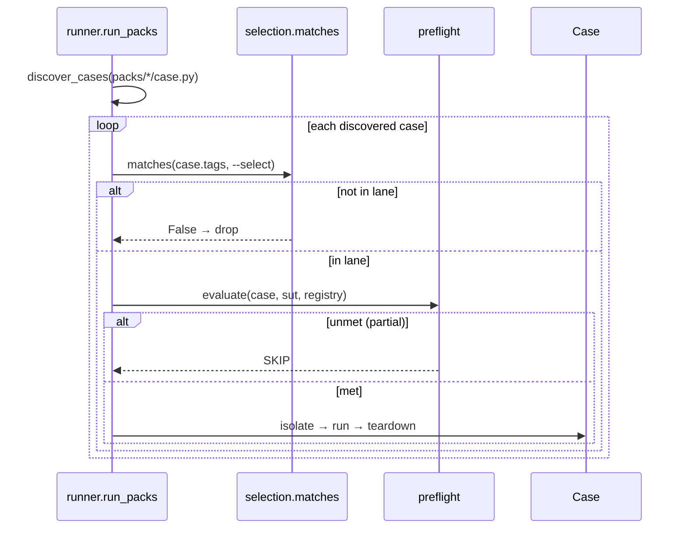

# Pre-flight requirements & test selection

Two independent axes let the gate run the right cases against the right environment:

- **Pre-flight** (`engine/preflight.py`) — a case declares prerequisites; the engine skips or blocks
  it when the **target backend** doesn't satisfy them.
- **Selection** (`engine/selection.py`) — a case declares tags; `--select` runs a subset (a lane).

## Pre-flight requirements

A case targeting several environments cannot assume every backend has the data/features it needs. It
declares them:

```python
class MyCase(RegressionCase):
    requires = ["platform_reachable", "catalog_seeded"]
```

The engine resolves each key against the target via a **registry** of `check(sut) -> bool`. The engine
always provides `platform_reachable`; a plugin adds its own from `sut/<name>/plugin.py`:

```python
# sut/acme/plugin.py
REQUIREMENTS = {"catalog_seeded": lambda sut: sut.get("/products")[0] == 200}
```

The registry refuses a duplicate key (`Registry.register` raises) so a plugin cannot silently shadow a
built-in or another plugin's check. Then `--preflight` decides what an unmet requirement means:

```mermaid
flowchart TD
  c([case with requires=[...]]) --> ev["preflight.evaluate(case, sut, registry)"]
  ev --> u{unmet keys?}
  u -- none --> run["run the case"]
  u -- "some" --> mode{--preflight mode}
  mode -- partial --> skip[/"status = SKIP<br/>reason recorded<br/>(the rest still run)"/]
  mode -- block --> fail[/status = FAIL<br/>'blocked on unmet requirement'/]
  run --> done([result])
  skip --> done
  fail --> done
```

- `partial` (default) **skips** an unmet case (distinct `SKIP` status — not a pass, not a fail) so the
  rest of the suite still runs.
- `block` **fails** it — use when every prerequisite must hold.
- A check that *raises* is treated as unmet (not a crash). An unknown requirement key is unmet with a
  clear reason.

> The false-green guard ([the gate](regression-gate.md)) makes an **all-skipped** run exit non-zero —
> `partial` skips must never be mistaken for verified-green.

## Tag-based selection

A case declares selection markers and a severity:

```python
class MyCase(RegressionCase):
    tags = frozenset({"smoke", "slow"})
    severity = "high"        # critical | high | medium | low  (declarative; for report grouping)
```

`--select` takes a boolean expression over those tags (`engine/selection.py` — a small, safe parser:
only tag identifiers, `and`/`or`/`not`, and parentheses; no `eval`):

```bash
python3 -m engine.run --sut sut/mock-shop --select "smoke and not slow"
python3 -m engine.run --sut sut/mock-shop --select smoke      # the smoke lane = make smoke
```

An empty/absent expression matches everything (the full gate). Selection is applied **before**
pre-flight, so a lane is filtered first and requirements are evaluated only for what remains:



## Lanes in CI

The CI pipeline maps tags to lanes (`.gitlab-ci.yml`): the `gate` job runs the full suite per
environment; the `smoke` job (web-triggered, not on every push) runs `--select smoke` for a fast
cross-environment confidence slice. A `slow` tag is the convention for minutes-long packs that belong
in a scheduled lane out of the blocking gate (`--select "not slow"`).

See also: [the regression gate](regression-gate.md), [targeting a real backend](remote-backend.md).
