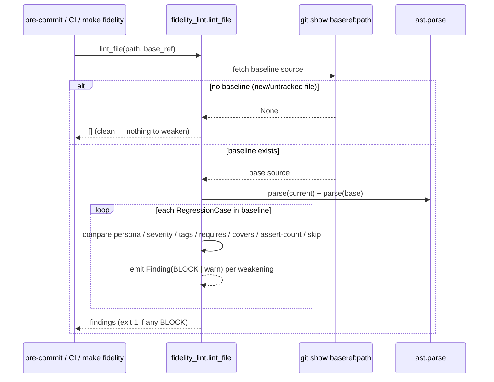
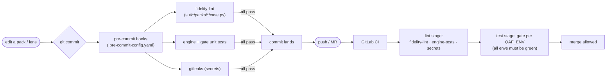

# Deterministic quality gates

A documented rule that nothing enforces is not followed. The framework's prime invariant — **never
weaken a spec to make a red gate go green** — plus the no-secrets and fresh-source rules are therefore
backed by **deterministic, code-enforced gates**, not only advisory review lenses. These are the
forcing functions; the [review-panel lenses](diagnostics-and-review-panel.md) add judgement on top but
never replace them.

| Gate | Module | Blocks on | Exit |
|------|--------|-----------|------|
| Spec-fidelity lint | `engine/fidelity_lint.py` | a weakened acceptance criterion vs the git baseline | `1` |
| Citation anti-fabrication | `engine/citation_gate.py` | a `source:line` a lens cited that does not resolve | `1` fabricated / `3` unverifiable |
| Source freshness | `engine/freshness_gate.py` | a stale/dirty remote source clone | `1` |
| Secret detection | `make secrets` + gitleaks | a hardcoded credential | `1` |
| Engine + gate units | `make test-engine` | a broken engine module | `1` |
| Code lint | `make lint` (ruff) | a lint violation | `1` |
| Dependency CVE scan | `make cve` (pip-audit) | a known vulnerability in a dependency | `1` |
| REST + unit tests | `make pytest` (pytest + xdist) | a failing REST pack / engine test | `1` |
| UI packs (browser) | `make test-ui` (pytest + Playwright) | a failing browser-driven UI pack | `1` |

The first five are **zero-dependency** (stdlib); `make check` runs them with no install. The last
three use the Poetry-managed dev toolchain (`make install`) — `make verify` runs all of them together.

```bash
make check         # the offline pre-commit ritual (zero-dep): test-engine + fidelity + secrets
make fidelity      # spec-fidelity lint over sut/*/{packs,ui-packs}/*/case.py (every site)
make lint          # ruff lint            (needs `make install`)
make cve           # pip-audit CVE scan   (needs `make install`)
make pytest        # REST packs + engine tests under pytest -n auto (UI excluded)
make test-ui       # browser (Playwright) UI packs — the opt-in UI lane
make verify        # everything: lint + cve + pytest + fidelity + secrets
python3 -m engine.citation_gate <files…>      # or pipe text on stdin
python3 -m engine.freshness_gate --sut sut/acme
```

## Spec-fidelity lint (`engine/fidelity_lint.py`)

> This is the deterministic check that backs the advisory **R-FIDELITY** lens. It lives in
> `engine/fidelity_lint.py` — **not** in `engine/diagnostics.py` (which only does the runtime
> REAL_BUG/TEST_BUG rate-classify). An LLM cannot hold this seat: identical input must give an
> identical verdict, so the gate is mechanical.

It diffs each changed `sut/*/packs/**/case.py` against its **git baseline** and flags, per `RegressionCase`:

- the case **class was removed** (lost coverage);
- **persona changed** (e.g. `existing_data → new_user` drops the durability contract);
- **severity downgraded** (`critical → … → low`);
- **`tags` / `requires` / `covers` shrank** (coverage or pre-flight quietly narrowed);
- the **count of soft-assert calls decreased** (assertions removed/loosened);
- a **skip/xfail escape hatch was added**.

A brand-new file has no baseline → nothing to weaken → clean. A legitimate refactor uses
`--allow-reshape`, which downgrades the shrink findings to warnings (mirrors the human-confirmed
reshape the R-FIDELITY lens escalates).



## Citation anti-fabrication (`engine/citation_gate.py`)

A review lens grounds a claim in a real `file:line` — `sut/<name>/source/<rel>:<line>` for a source-backed
SUT, or `sut/<name>/{tickets,skills,learnings,specs}/<rel>:<line>` (the ticket/doc snapshot) for a
sourceless one. This gate resolves each citation against the real file:

- file missing **or** line out of range → **FABRICATED** (exit `1`, hard block — a lens invented
  evidence);
- a `source/` dir is absent (e.g. a remote plugin with no clone) → **UNVERIFIABLE** (exit `3`, reported
  distinctly — not the lens's fault). A **sourceless** SUT (no `source` declared) instead cites the
  ticket/doc snapshot, which IS in-repo — so its anchors resolve (or **FABRICATE** on a miss), and only a
  genuinely absent `source/` clone stays UNVERIFIABLE;
- otherwise → OK.

## Source freshness (`engine/freshness_gate.py`)

If a plugin's source is a checked-out clone of a real backend (`runtime.mode == remote`), a stale
clone means a lens could cite code that no longer matches production. The gate compares the clone's
`HEAD` against `origin/HEAD`: in sync → **FRESH**; dirty/behind/ahead → **STALE** (exit `1`). For an
`in_process` plugin (the mock — source *is* the app) it is a **FRESH** no-op. For a **sourceless** SUT
(no `source` declared) it is likewise a **FRESH** no-op — checked *before* the remote-clone path, so a
sourceless-but-remote SUT never triggers the `HEAD` comparison; its ticket/doc snapshot is committed
in-repo, always current.

## Where each gate fires



The `make check` target runs the offline subset locally; `.pre-commit-config.yaml` runs the fidelity
lint + unit tests + gitleaks at commit time; `.gitlab-ci.yml` re-runs them in the `lint` stage and
adds the multi-environment merge gate. Each rule has a forcing function at the point of consumption —
not a reminder a reviewer must remember.

See also: [diagnostics & the review panel](diagnostics-and-review-panel.md) (the advisory lenses these
gates back).
