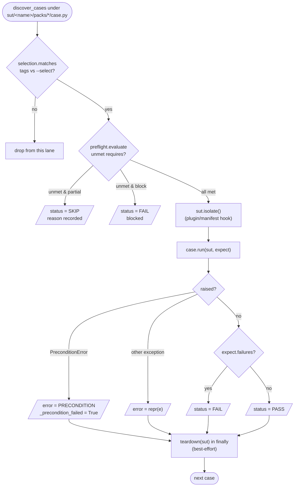
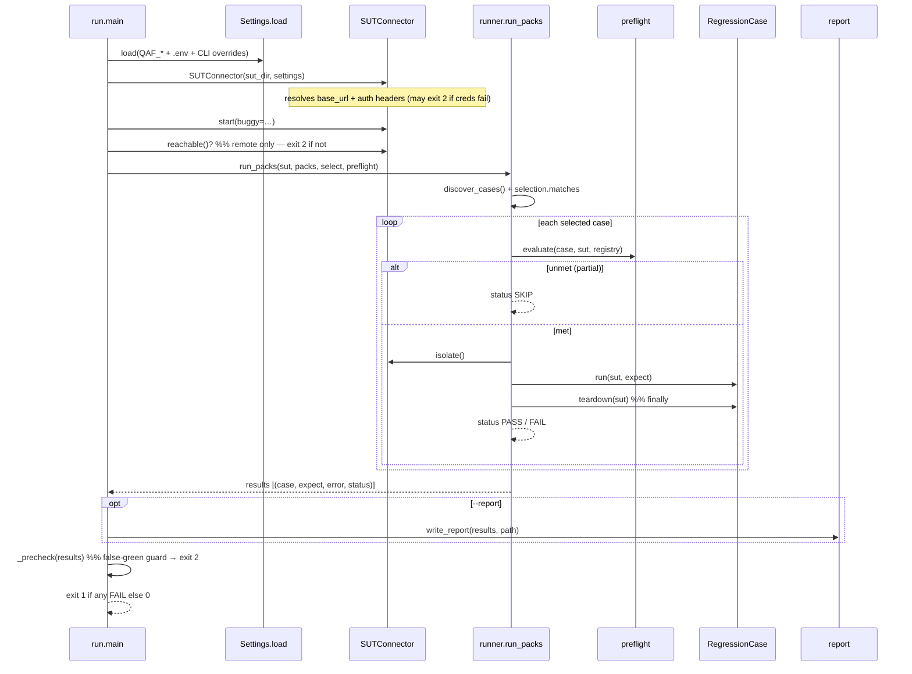

# The regression gate

The gate is the REGRESS capability: `engine/run.py` drives `engine/runner.py` to discover every
pack, run it against the live backend, and exit non-zero if anything fails — so CI can gate a merge
on it. Green is a precondition to landing.

```bash
python3 -m engine.run --sut sut/mock-shop                 # full gate
python3 -m engine.run --sut sut/mock-shop --select smoke  # one lane
python3 -m engine.run --sut sut/mock-shop --report report.xml   # + JUnit artifact
make test            # the full gate
make smoke           # the smoke lane
```

## Exit codes

| Code | Meaning |
|------|---------|
| `0` | every selected case passed (or skipped under `partial` with at least one real pass) |
| `1` | at least one case FAILED |
| `2` | the **false-green guard** tripped — no cases ran / all skipped / SUT unreachable / credentials unresolved |

The exit-2 guard (`engine/run.py:_precheck`) exists so an empty or all-skipped run can never report
success — a run that verified nothing must not be mistaken for a green gate.

## Per-case lifecycle

Each case runs from a clean state, with pre-flight evaluated first and teardown guaranteed:



Key properties (`engine/runner.py`):

- **Selection before preflight** — a lane (`--select`) is filtered first, then requirements are
  evaluated only for the cases that remain.
- **`isolate()` is a hook, not a hardcoded endpoint** — the runner calls `sut.isolate()`, which uses
  the plugin's `isolate(sut)` or the manifest's `runtime.isolate` path (the mock's `/cart/clear`),
  else a no-op. The generic runner stays product-neutral.
- **Teardown always runs** — `case.teardown(sut)` is called in a `finally`, best-effort: a cleanup
  error is logged and swallowed so one failure cannot abort the rest of the gate.
- **A precondition is a real verdict** — `expect.precondition(...)` raises `PreconditionError`, which
  the runner tags so [diagnostics](diagnostics-and-review-panel.md) classifies it as a genuine failure,
  not transient infrastructure.

## Call sequence of a run



## The report artifact

`--report report.xml` writes JUnit XML (a CI "Tests" tab renders it); `--report report.json` writes
JSON for triage tooling (`engine/report.py`). Each case becomes a `<testcase>`; a SKIP is `<skipped>`,
a FAIL carries the collected failure details. In CI the gate uploads it as an artifact even on failure
(`.gitlab-ci.yml`, `artifacts.when: always`).

See also: [pre-flight & selection](preflight-and-selection.md), [personas & durability](personas-and-durability.md).
