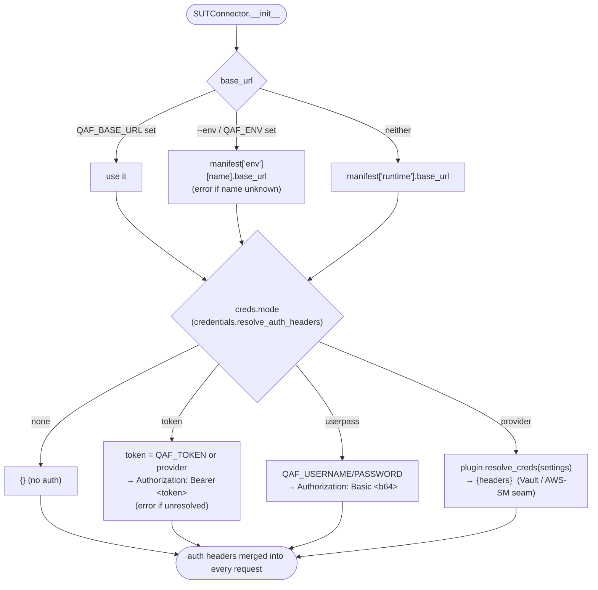

# Targeting a real (remote) backend

The mock runs `in_process` and needs no auth. A real product is a plugin with
`runtime.mode == "remote"`; reaching it needs credentials, environment selection, TLS handling, and
resilience — all provided by the `SUTConnector` seam so a plugin supplies *what* without editing the
engine.

```bash
# secrets + per-run target live OUTSIDE committed config (env or a gitignored .env)
export QAF_ENV=staging
export QAF_TOKEN=…              # never committed
python3 -m engine.run --sut sut/acme --env staging        # or --base_url https://…
```

## The uncommitted config channel (`engine/config.py`)

`manifest.json` is committed, so it cannot carry a secret or a per-developer/per-CI choice. Those come
from the environment (prefix `QAF_`) or an optional gitignored `.env`, merged by `Settings.load()`:

| Variable | Effect |
|----------|--------|
| `QAF_ENV` | select an environment from `manifest["env"]` |
| `QAF_BASE_URL` | override the base_url outright |
| `QAF_TOKEN` | bearer token / API key (`creds.mode = token`) |
| `QAF_USERNAME` / `QAF_PASSWORD` | HTTP basic (`creds.mode = userpass`) |
| `QAF_VERIFY_TLS` | `0`/`false` to skip TLS verification (self-signed onprem cert) |
| `QAF_PREFLIGHT` | `partial` (skip unmet) or `block` (fail unmet) |

**Precedence:** CLI flag > environment variable > `.env` file > manifest default.

## Base-URL resolution + credential dispatch



A direct value in `Settings` always wins; the provider only fills gaps. If a backend declares auth but
nothing resolves, `resolve_auth_headers` raises `CredentialError` and the gate exits **2** (a
false-green guard — see [the gate](regression-gate.md)) rather than silently running unauthenticated.

The `provider` mode is the seam for a real secrets store: a plugin ships `resolve_creds(settings)` in
`sut/<name>/plugin.py` and Vault/AWS-SM/etc. plug in without touching `engine/`.

## A single request

Every call goes through `SUTConnector.request()` — one choke point for auth, masking, TLS, and retry:

```mermaid
sequenceDiagram
  participant Case
  participant Req as SUTConnector.request
  participant Mask as masking.mask
  participant Net as urllib.urlopen
  participant Backend

  Case->>Req: get/post/delete(path, body)
  Req->>Req: headers = {Content-Type} + auth_headers
  opt log=True
    Req->>Mask: mask(headers), mask(body)
    Mask-->>Req: secrets redacted
    Req-->>Case: print masked request line
  end
  loop attempt 1..3
    Req->>Net: urlopen(req, timeout=15, ssl ctx)
    alt 2xx / 4xx (non-retryable)
      Net->>Backend: request
      Backend-->>Net: status, body
      Net-->>Req: return (status, json)
    else transient (GET 502/503/504, write 502/503)
      Net-->>Req: HTTPError
      Req->>Req: sleep backoff (0.2 * 2^attempt), retry
    else connection error / timeout
      Net-->>Req: URLError/TimeoutError
      Req->>Req: backoff + retry; raise after last attempt
    end
  end
  Req-->>Case: (status, json)
```

Resilience details (`engine/sut.py`):

- **Idempotency-aware retry** — a `GET` retries `502/503/504`; a write retries only `502/503` (a `504`
  on a `POST` may mean the create succeeded server-side, so retrying could duplicate it). Connection
  errors and timeouts retry with exponential backoff and re-raise after the last attempt.
- **Secret masking at the logging boundary** — `masking.mask` deep-redacts known credential keys
  (`authorization`, `token`, `password`, `cookie`, …) before anything is printed, so an auth-bearing
  request never leaks into gate output.
- **TLS toggle** — HTTPS uses urllib's verifying context by default; `runtime.verify_tls: false` (or
  `QAF_VERIFY_TLS=0`) switches to an unverified context for self-signed onprem certs.
- **Pagination** — `paginate(first_path, items_of, next_of)` follows a list endpoint's `next` link to
  exhaustion, so an existence/idempotency check doesn't false-negative as the backend's data grows.

## Plugin hooks for a real backend

`sut/<name>/plugin.py` (optional) supplies the behaviours the engine calls when present:
`REQUIREMENTS` (pre-flight checks — see [pre-flight & selection](preflight-and-selection.md)),
`resolve_creds`, `isolate(sut)`, and `sweep(sut, max_age, dry_run)` (orphan reaper). See the full
[SUT contract](../sut/contract.md).

## Multi-environment gate

The CI `gate` job fans a matrix over `QAF_ENV` and requires all green (`.gitlab-ci.yml`) — the generic
form of running the suite against staging + prod and merging only if both pass.
